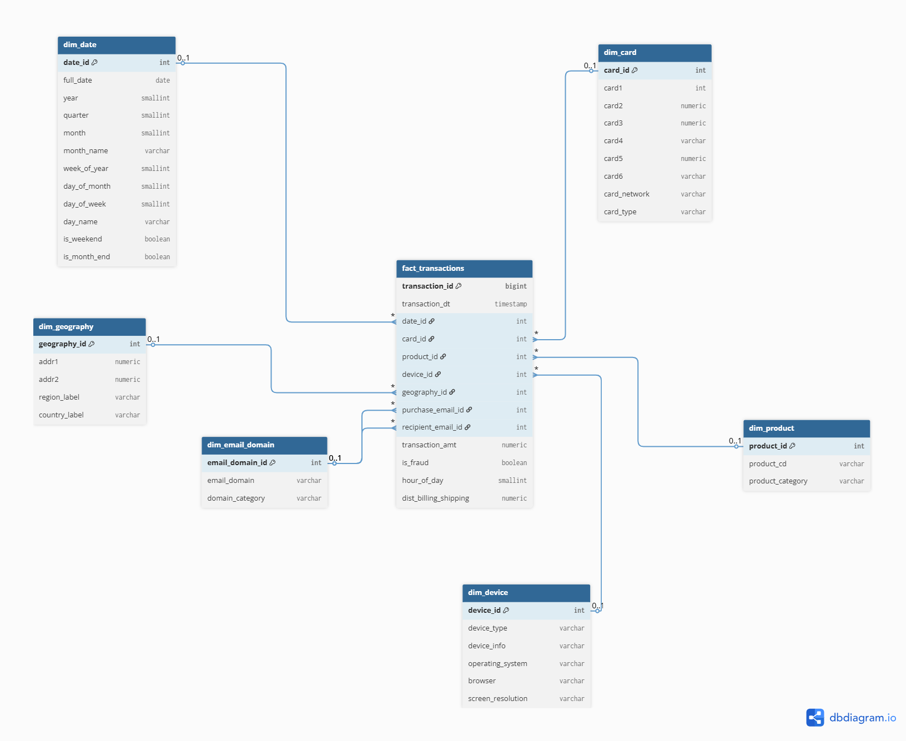
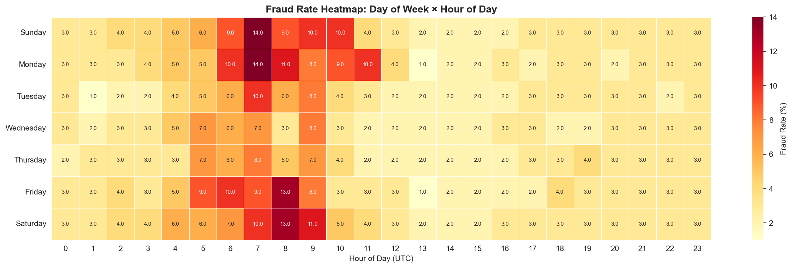
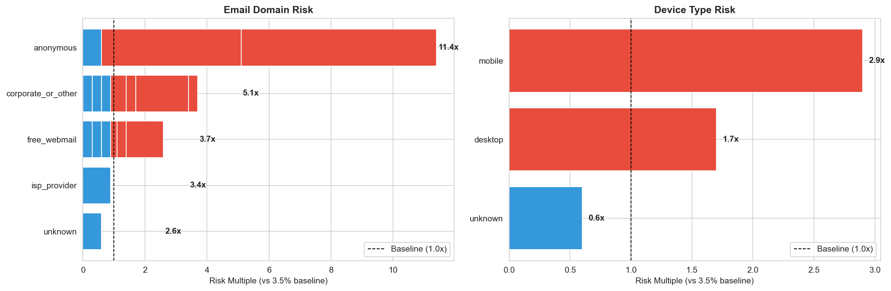
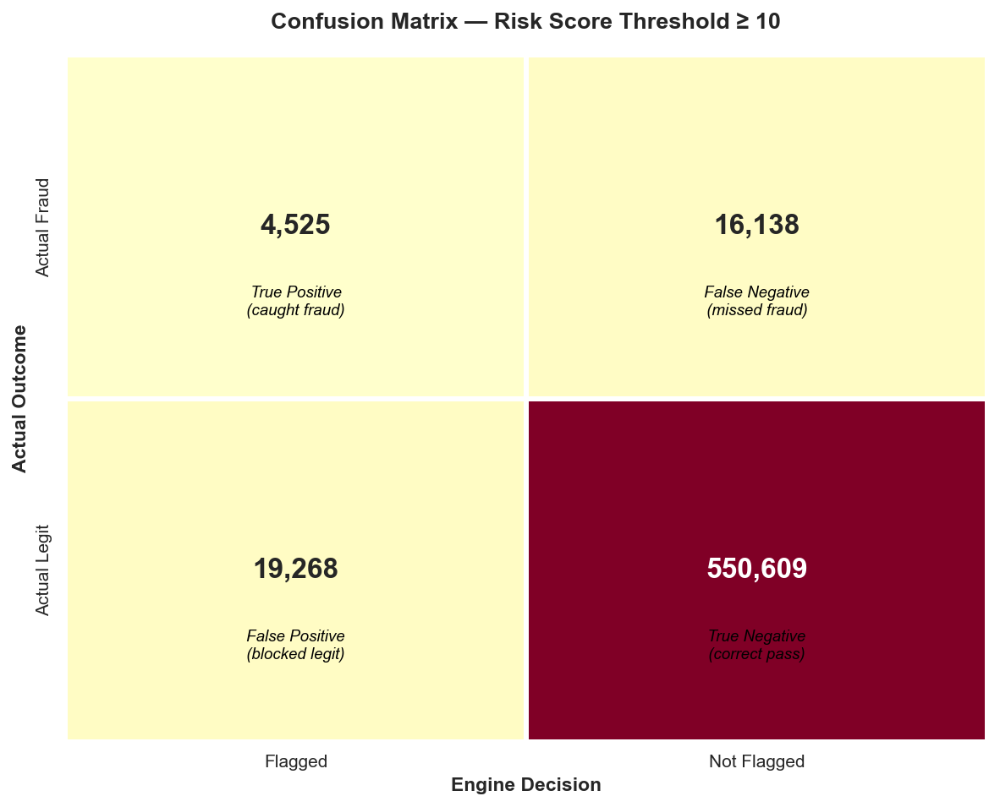

# Credit Card Fraud Analytics — SQL Data Warehouse & Detection Engine

A PostgreSQL analytical project that models **590,540 credit card transactions** into a
star-schema data warehouse and builds a rule-based fraud detection engine — with all
transformation and analytical logic implemented in SQL.



---

## Overview

This project analyzes the [IEEE-CIS Fraud Detection dataset](https://www.kaggle.com/competitions/ieee-fraud-detection)
(590,540 transactions, December 2017 – June 2018) to answer a core business question:
**where does fraud concentrate, and can it be detected with rule-based logic?**

The work is structured as a dimensional data warehouse followed by five analytical
phases, culminating in a fraud detection engine evaluated on precision, recall, and
business cost-benefit.

The guiding principle throughout: **SQL is the system of record.** All cleaning,
transformation, and analysis happen inside PostgreSQL. Python is used only for CSV
pre-processing, database connectivity, and visualization — mirroring how production
analytics teams separate transformation logic from presentation.

---

---

## Key Findings

- **Overall fraud rate:** 3.5% by transaction count.
- **Highest-risk segment:** Card-Not-Present + Credit + free webmail + high value —
  a **26.3% fraud rate**, 7.5× the baseline.
- **Fraud concentration:** Two segments (Card-Not-Present and Web Purchase, both paired
  with free webmail domains) together contain **~66% of all fraud**.
- **Email domain is a strong signal:** Anonymous email domains carry an 11× risk
  multiple versus baseline; free webmail dominates fraud by sheer volume.
- **Detection engine:** At the cost-optimal threshold, the engine catches **4,525 of
  20,663 fraud cases (21.9% recall)** at 19.0% precision, generating **$245,722 in net
  benefit** under a conservative cost model.
- **Notable null result:** Transaction *velocity* — typically the single strongest
  fraud signal in production systems — proved **unusable** in this dataset because
  anonymization makes card identifiers represent *clusters* of similar cards rather
  than individual cards. This is documented as a finding, not hidden.

---

---

## Detection Engine Performance

The engine scores each transaction against six rules derived empirically from the
segmentation analysis, then flags transactions above a risk threshold. The threshold was
selected by **maximizing net business benefit**, not by maximizing a statistical metric.

|                     | Flagged | Not Flagged |
|---------------------|--------:|------------:|
| **Actual Fraud**    |   4,525 |      16,138 |
| **Actual Legit**    |  19,268 |     550,609 |

- **Precision:** 19.0%
- **Recall:** 21.9%
- **Net benefit:** $245,722 (fraud value caught minus false-positive review cost,
  assuming a missed fraud costs the full transaction value and a false positive costs
  $5 in review friction)

A key insight emerged from threshold tuning: because the cost of missing fraud vastly
exceeds the cost of a false-positive review, the **business-optimal threshold differs
from the F1-optimal threshold** — the engine should flag aggressively for human review
rather than auto-block. Broader coverage rules were tested and rejected because they
*lowered* net benefit despite raising recall (see Phase 5).

---

---

## Tech Stack

- **PostgreSQL 16** — data warehouse; all transformation and analytical logic
- **Python** (pandas, SQLAlchemy, python-dotenv) — CSV pre-processing, DB connectivity, visualization
- **Jupyter** — analytical notebooks
- **matplotlib / seaborn** — charts

---

## Architecture

```
Raw CSV (394 cols)
      │  Python — column slimming only
      ▼
PostgreSQL staging schema  (raw mirror)
      │  SQL — cleaning, standardization, dedup
      ▼
Dimensional ETL  (INSERT … SELECT DISTINCT)
      ▼
Star schema: fact_transactions + 6 dimensions
      │  SQL — five analytical phases
      ▼
Jupyter notebooks  (SQLAlchemy → pandas → charts + narrative)
```

The star schema uses a fact table (`fact_transactions`, one row per transaction) joined
to six dimensions: date, card, product, device, geography, and email domain. Email domain
is a **role-playing dimension** — referenced twice (purchaser and recipient) from a single
canonical table. Missing data is handled with explicit "unknown" dimension rows rather than
NULL foreign keys, so every downstream query is a clean inner join.

---

## Analytical Phases

| Phase | Focus | Headline Technique |
|-------|-------|--------------------|
| 1. Fraud Landscape | Baseline rates by product, network, card type, amount | `FILTER`, `GROUPING SETS` |
| 2. Temporal Patterns | Hour-of-day, day-of-week, weekly trends | `DATE_TRUNC`, hour×day heatmap |
| 3. Velocity Analytics | Per-card transaction velocity (and why it failed) | `RANGE BETWEEN INTERVAL` window frames |
| 4. Segmentation | Multi-dimensional risk profiling | `NTILE`, `CUBE`, risk multiples |
| 5. Rule Engine | Detection rules + precision/recall + cost-benefit | Multi-CTE composition, confusion matrix in SQL |

---

## SQL Techniques Demonstrated

`FILTER` clause · `GROUPING SETS` · `CUBE` · `NTILE` · `PERCENTILE_CONT` ·
`RANGE BETWEEN INTERVAL` time-based window frames · common table expressions ·
star-schema dimensional modeling · role-playing dimensions · point-in-time timestamp
reconstruction · confusion-matrix and precision/recall computation entirely in SQL

---

## How to Run

1. **Get the data.** Download the [IEEE-CIS dataset](https://www.kaggle.com/competitions/ieee-fraud-detection/data)
   and place `train_transaction.csv` and `train_identity.csv` in `data/raw/`.
2. **Pre-process.** Run `scripts/python/01_preprocess_csv.py` to produce slim CSVs in `data/processed/`.
3. **Build the warehouse.** Execute the SQL files in `sql/` in numeric order (`01` through `09`):
   create database → schemas → staging → load → dimensions → fact → ETL.
4. **Analyze.** Open the notebooks in `notebooks/` in order to reproduce all five phases.

Database credentials load from a `.env` file — copy `.env.example` to `.env` and fill in
your local PostgreSQL details.

```
DB_USER=postgres
DB_PASS=your_password
DB_HOST=localhost
DB_PORT=5432
DB_NAME=fraud_analytics
```

---

## Repository Structure

```
credit-card-fraud-analytics/
├── README.md
├── requirements.txt
├── .env.example
├── data/
│   ├── raw/                 # IEEE-CIS CSVs (gitignored)
│   └── processed/           # slim CSVs (gitignored)
├── scripts/python/
│   └── 01_preprocess_csv.py # CSV column slimming
├── sql/
│   ├── 01_create_database.sql
│   ├── 02_create_schemas.sql
│   ├── 03_staging_tables.sql
│   ├── 04_load_staging.sql
│   ├── 05_sanity_checks.sql
│   ├── 06_dimension_ddl.sql
│   ├── 07_fact_ddl.sql
│   ├── 08_etl_dimensions.sql
│   ├── 09_etl_fact.sql
│   └── analysis/
│       ├── phase1_fraud_landscape.sql
│       ├── phase2_temporal_patterns.sql
│       ├── phase3_velocity_analytics.sql
│       ├── phase4_segmentation.sql
│       └── phase5_rule_engine.sql
├── notebooks/
│   ├── 01_data_loading_schema.ipynb
│   ├── 02_phase1_fraud_landscape.ipynb
│   ├── 03_phase2_temporal_patterns.ipynb
│   ├── 04_phase3_velocity_analytics.ipynb
│   ├── 05_phase4_segmentation.ipynb
│   └── 06_phase5_rule_engine.ipynb
├── docs/
│   ├── er_diagram.png
│   └── findings_report.md
└── visuals/                 # exported charts
```

---

## Data Source

[IEEE-CIS Fraud Detection](https://www.kaggle.com/competitions/ieee-fraud-detection) —
a Kaggle competition dataset provided by Vesta Corporation. The raw data is not included
in this repository (competition terms + file size); download instructions are above.

---

## Notes on Methodology & Honesty

This project deliberately reports modest detection performance (21.9% recall) because that
is the genuine ceiling imposed by the dataset's anonymized, categorical-only feature set.
The strongest production fraud signal — per-card velocity — is unavailable here by design.
Rather than inflate results, the analysis documents this constraint (Phase 3), tests
against it (Phase 5 rule rejection), and frames the engine as a first-pass review filter
that would, in production, be complemented by velocity features and a machine-learning
layer trained on richer signals. Demonstrating awareness of a method's limits is treated
here as part of the analysis, not an afterthought.